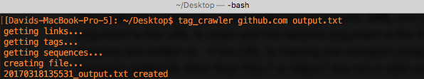

# TagCrawler

Tagcrawler will crawl a URL and output all the links, HTML tags, and sequences on the page. 
Sequences are two or more words that have the first letter in each word capitalized.

## Installation

    $ gem install tag_crawler

## Usage

The first argument is the URL to crawl. If the URL is missing the transport protocol, it will assume http://. Only http:// and https:// protocols are valid.

The second argument is the OUTPUT file that the extracted features will be written to.

	 	$ tag_crawler https://github.com output.txt

The output file name will be in the form YYYYMMDDHHMMSS_output, a timestamp followed by the output file name provided.

